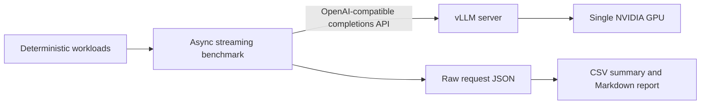

# vLLM Serving Lab

[中文说明](README_CN.md)

A compact, reproducible single-GPU serving benchmark for four practical vLLM topics:

- Paged KV cache behavior under mixed sequence lengths.
- Continuous batching throughput and latency under controlled concurrency.
- Prefix caching for requests that share a long prompt prefix.
- Capacity under joint TTFT/TPOT constraints with a fixed request arrival rate.

The project deliberately stays small. It uses the official vLLM OpenAI-compatible server, a shared asynchronous Python client, and PowerShell experiment runners. It contains no web UI, database, Kubernetes, multi-GPU deployment, RAG, or agent workflow.

## Prefix Cache three-stage study

The branch includes three runnable experiment layers. `session-chat` models multi-turn support or coding-agent traffic with stable per-session prefixes, growing history, configurable idle gaps, and optional unique background prefixes. Run the first-stage matrix with:

```powershell
.\scripts\Run-PrefixScenarios.ps1 -IdleGapsMs 0,30000 -BackgroundUniquePrefixes 0,4 -Requests 32 -Repeats 1 -Offline
```

For capacity sensitivity, restart a clean vLLM process at each GPU KV pool size:

```powershell
.\scripts\Run-KvCapacity.ps1 -CapacitiesMiB 128,256,512 -Requests 60 -Repeats 1 -Offline
```

The third-stage runner compares GPU-only Prefix Cache with the vLLM 0.10.2 V1 `kv_transfer_config` path and the repository's `CpuL2Connector`. The connector reuses vLLM's official shared-storage implementation, adds a bounded host-side LRU and an optional two-hit admission policy, and is loaded dynamically inside the container:

```powershell
.\scripts\Run-KvTiers.ps1 -GpuCapacityMiB 256 -CpuCapacityMiB 512 -Requests 60 -Offline
```

The host L2 stores safetensors under a mounted directory; this is an intentionally small single-host experiment, not a claim of RDMA, multi-node, compression, or production LMCache behavior. Every benchmark artifact includes request-level timing, workload metadata, and raw `/metrics` snapshots when the server exposes them.

## Architecture



The client measures request start, first non-empty streamed token, completion time, and the final OpenAI `usage` record. It reports TTFT, TPOT, P50/P95 latency, request throughput, effective input-token throughput, output-token throughput, success rate, and optional GPU samples. Host-side GPU sampling is disabled by default on WDDM because an unstable driver query can distort a serving benchmark.

## Experiment design

The default configuration serves `Qwen/Qwen2.5-1.5B-Instruct` in FP16 with a 2,048-token context window on one GPU. Chunked prefill is left at the pinned vLLM image default and remains identical across every profile, so the controlled comparisons vary only the setting named in each experiment.

| Config | Workload | Client concurrency | Server `max-num-seqs` | Prefix cache |
|---|---|---:|---:|:---:|
| `cb_serial` | mixed 128/512/1024-word prompts | 8 | 1 | off |
| `cb_batch` | mixed 128/512/1024-word prompts | 8 | 8 | off |
| `cb_scale_1` | mixed 128/512/1024-word prompts | 1 | 8 | off |
| `cb_scale_4` | mixed 128/512/1024-word prompts | 4 | 8 | off |
| `pc_off` | shared 960-word prefix | 8 | 8 | off |
| `pc_on` | shared 960-word prefix | 8 | 8 | on |

`cb_serial` is a serialized-capacity control, not a different vLLM implementation with its scheduler removed. Paged KV cache is a core engine mechanism and has no clean on/off flag; the mixed-length workload validates its use without claiming an isolated PagedAttention speedup.

## Reference results

The committed run was captured on an NVIDIA GeForce RTX 4070 Laptop GPU (8,188 MiB), NVIDIA driver 581.57, Docker Desktop, and `vllm/vllm-openai:v0.10.2`. All 1,080 measured requests across 18 runs completed successfully. Each value below is the median of three run-level metrics.

| Comparison | Baseline | Optimized | Measured change |
|---|---:|---:|---:|
| Output throughput, client concurrency 8 | `max-num-seqs=1`: 9.28 tok/s | `max-num-seqs=8`: 259.05 tok/s | +2690.08% |
| P95 latency, client concurrency 8 | `max-num-seqs=1`: 62.09 s | `max-num-seqs=8`: 2.21 s | -96.44% |
| Shared-prefix TTFT P50 | Prefix cache off: 8,753 ms | Prefix cache on: 205 ms | -97.66% |
| Shared-prefix effective input throughput | Prefix cache off: 211.89 tok/s | Prefix cache on: 4,220.85 tok/s | +1891.97% |

These are local workload results, not framework-wide speedup claims. The serialized control intentionally limits the server to one active sequence, and the prefix-cache result applies to a repeated approximately 960-word prefix. Laptop power state, WDDM, and Docker Desktop caused visible cross-run variation, so the repository reports medians and keeps every raw request record.

### SLO capacity results (2026-09-07)

A separate open-loop sweep measured **5,400 requests across nine runs**, with approximately 120 seconds of arrivals per run. All requests succeeded and all offered loads were valid. The joint SLO requires TTFT <=1,000 ms and TPOT <=50 ms/token for at least 95% of requests.

| Arrival req/s | Passing repeats | Joint SLO range | TTFT P95 ms, median | Goodput req/s, median |
|---:|---:|---:|---:|---:|
| 4 | 3/3 | 100% | 123.77 | 3.969 |
| 5 | 3/3 | 100% | 335.97 | 4.958 |
| 6 | 0/3 | 3.33-4.58% | 20,376.50 | 0.231 |

**5 req/s is the highest sampled rate passing all three repeats; 6 req/s consistently fails.** Rates between them are unmeasured. At 6 req/s, all SLO misses were TTFT violations, while TPOT remained below its threshold. Median output throughput rose only from 317.33 to 323.60 tok/s between 5 and 6 req/s, while client inflight accumulated and median drain time rose from 1.23 to 22.57 seconds. Successful responses alone therefore substantially overstate useful capacity here.

This sweep uses actual input lengths of 154/538/1050 tokens, 64 output tokens, `max-num-seqs=8`, prefix caching off, and GPU memory utilization **0.50**. It is a finite-run boundary for this workload, not a production guarantee or a speedup over the historical 0.85-memory runs. See the [full report](results/report.md#slo-constrained-capacity-experiment-2026-09-07) and [all individual runs](results/capacity/20260907-capacity/report.md).

## Requirements

- Windows 11 with Docker Desktop using Linux containers, or an equivalent Linux Docker host.
- NVIDIA GPU and a working NVIDIA Container Toolkit / Docker GPU integration.
- Python 3.10 or newer for the benchmark client.
- Enough local disk space for the vLLM image and model cache.

## Setup

```powershell
python -m venv .venv
```

Activate the environment created by your Python distribution, then install the small host-side dependency set:

```powershell
python -m pip install -e ".[dev]"
python -m pytest
```

The model runs inside `vllm/vllm-openai:v0.10.2`; vLLM and PyTorch are not installed into the host environment.

## Run the full benchmark

Start Docker Desktop first, then run:

```powershell
powershell -ExecutionPolicy Bypass -File .\scripts\Run-Experiments.ps1
```

The runner loads three server profiles and executes 60 measured requests per client configuration, with eight warm-ups and three independent repeats. Model files and vLLM compile artifacts are cached under `.cache/huggingface` and `.cache/vllm` inside this repository, so all large caches remain on the same drive as the project.

Outputs:

```text
results/raw/<run-id>/*.json   per-request timing and usage records
results/summary.csv           median run-level metrics by config
results/report.md             comparisons and interpretation boundaries
```

Override the repeat count for a quick smoke run:

```powershell
powershell -ExecutionPolicy Bypass -File .\scripts\Run-Experiments.ps1 -Repeats 1 -RunId smoke
```

## Run the SLO capacity sweep

```powershell
.\scripts\Run-Capacity.ps1 -Rates 4,5,6 -Offline
```

Omit `-Offline` on the first run if the model is not cached. The script uses the project's existing `.venv`, starts one fixed GPU server, and stops that container after the sweep. `-UseExistingServer` reuses a container named `vllm-serving-lab-capacity` and leaves it running. The default GPU memory utilization for this sweep is **0.50** to coexist with desktop applications; the historical experiment matrix used **0.85**.

The capacity runner reuses the existing streaming client and mixed workload, with no new dependencies:

- Uniform open-loop arrivals: send at the scheduled rate without waiting for earlier responses. Record actual dispatch rate and dispatch lag to detect client bottlenecks.
- Equal proportions of 128/512/1024-word prompt bodies, plus request headers and instructions; request 64 output tokens with temperature 0 and `ignore_eos`. Actual tokenizer usage is retained.
- Joint SLO: a request must succeed with **TTFT <= 1,000 ms AND TPOT <= 50 ms/token**. At least **95% of all planned requests** must meet both thresholds for a run to pass.
- Three repeats per rate, each with eight warm-ups and `max(300, ceil(rate * 120))` measured requests, giving an approximately two-minute arrival window at the measured rates. Alternate ascending/descending rate order across repeats.
- A 30-second total request deadline and a 128-request client safety cap. Undispatched requests and failures remain in the denominator. A run with undispatched requests, rate error over 5%, or dispatch-lag P95 over 100 ms cannot pass.
- Goodput = SLO-compliant requests / elapsed time, **including drain after the last arrival**. Record client inflight samples and drain time to expose accumulation. Inflight is not vLLM's internal queue length.

TTFT is measured from actual dispatch to first non-empty content. TPOT is `(stream completion - first content) / (output tokens - 1)`, including the protocol tail; it is not a per-token stall percentile. Latency percentiles cover successful requests, while joint SLO attainment includes all planned requests.

Outputs are saved incrementally in `results/capacity/<run-id>/`: raw request JSON, `summary.csv`, `report.md`, and server/environment metadata. A short smoke run is available with `-Rates 2 -Repeats 1 -Requests 40 -MinDuration 0`; its result cannot establish sustained capacity. See the [measured capacity report](results/capacity/20260907-capacity/report.md) for the longer repeated sweep.

## Run one benchmark manually

After starting a compatible vLLM server on port 8000:

```powershell
python -m vllm_serving_lab.benchmark `
  --model Qwen/Qwen2.5-1.5B-Instruct `
  --workload mixed `
  --config-name cb_batch `
  --concurrency 8 `
  --server-max-num-seqs 8 `
  --server-image vllm/vllm-openai:v0.10.2 `
  --run-number 1 `
  --no-prefix-caching `
  --output results/raw/manual/cb_batch_run1.json
```

## Repository layout

```text
configs/experiments.json           model, server profiles, and benchmark matrix
scripts/Start-VllmServer.ps1       start and health-check one GPU container
scripts/Run-Experiments.ps1        execute the controlled experiment matrix
scripts/Run-Capacity.ps1           execute a fixed-server open-loop SLO sweep
src/vllm_serving_lab/client.py     OpenAI SSE streaming client
src/vllm_serving_lab/benchmark.py  closed-loop concurrency and GPU sampling
src/vllm_serving_lab/capacity.py   arrival scheduling, joint SLO, and goodput
src/vllm_serving_lab/summarize.py  run-level aggregation and report generation
tests/                             unit and mock-server integration tests
```

## Interpretation boundaries

- Results are local, single-GPU serving measurements, not production capacity guarantees.
- The prompt sizes in the workload name are generation targets; raw artifacts retain the actual tokenizer usage returned by vLLM.
- Prefix-cache gains apply only to traffic with a sufficiently long shared token prefix and meaningful cache hit rate.
- Throughput and tail latency must be reported together. Higher concurrency can increase throughput while worsening per-request latency.
- This repository uses vLLM's Paged KV cache and continuous scheduler; it does not reimplement either mechanism.
- Host `nvidia-smi` produced invalid memory values in some WDDM runs. Those samples are excluded, and no reported optimization claim depends on GPU-memory measurements.

## License

MIT
