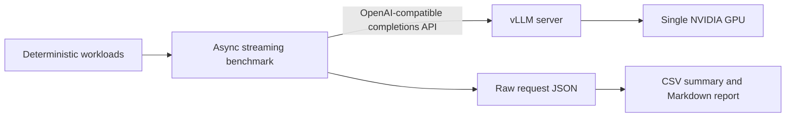

# vLLM Serving Lab

[中文说明](README_CN.md)

A compact, reproducible single-GPU serving benchmark for three practical vLLM topics:

- Paged KV cache behavior under mixed sequence lengths.
- Continuous batching throughput and latency under controlled concurrency.
- Prefix caching for requests that share a long prompt prefix.

The project deliberately stays small. It uses the official vLLM OpenAI-compatible server, one asynchronous Python benchmark client, and one PowerShell experiment runner. It contains no web UI, database, Kubernetes, multi-GPU deployment, RAG, or agent workflow.

## Architecture



The client measures request start, first non-empty streamed token, completion time, and the final OpenAI `usage` record. It reports TTFT, TPOT, P50/P95 latency, request throughput, effective input-token throughput, output-token throughput, success rate, and optional GPU samples. Host-side GPU sampling is disabled by default on WDDM because an unstable driver query can distort a serving benchmark.

## Experiment design

The default configuration serves `Qwen/Qwen2.5-1.5B-Instruct` in FP16 with a 2,048-token context window on one GPU. Chunked prefill is left at the pinned vLLM image default and remains identical across every profile, so the controlled comparisons vary only the setting named in each experiment.

| Config | Workload | Client concurrency | Server `max-num-seqs` | Prefix cache |
|---|---|---:|---:|:---:|
| `cb_serial` | mixed 128/512/1024-word prompts | 8 | 1 | off |
| `cb_batch` | mixed 128/512/1024-word prompts | 8 | 8 | off |
| `cb_scale_1` | mixed 128/512/1024-word prompts | 1 | 8 | off |
| `cb_scale_4` | mixed 128/512/1024-word prompts | 4 | 8 | off |
| `pc_off` | shared 960-word prefix | 8 | 8 | off |
| `pc_on` | shared 960-word prefix | 8 | 8 | on |

`cb_serial` is a serialized-capacity control, not a different vLLM implementation with its scheduler removed. Paged KV cache is a core engine mechanism and has no clean on/off flag; the mixed-length workload validates its use without claiming an isolated PagedAttention speedup.

## Reference results

The committed run was captured on an NVIDIA GeForce RTX 4070 Laptop GPU (8,188 MiB), NVIDIA driver 581.57, Docker Desktop, and `vllm/vllm-openai:v0.10.2`. All 1,080 measured requests across 18 runs completed successfully. Each value below is the median of three run-level metrics.

| Comparison | Baseline | Optimized | Measured change |
|---|---:|---:|---:|
| Output throughput, client concurrency 8 | `max-num-seqs=1`: 9.28 tok/s | `max-num-seqs=8`: 259.05 tok/s | +2690.08% |
| P95 latency, client concurrency 8 | `max-num-seqs=1`: 62.09 s | `max-num-seqs=8`: 2.21 s | -96.44% |
| Shared-prefix TTFT P50 | Prefix cache off: 8,753 ms | Prefix cache on: 205 ms | -97.66% |
| Shared-prefix effective input throughput | Prefix cache off: 211.89 tok/s | Prefix cache on: 4,220.85 tok/s | +1891.97% |

These are local workload results, not framework-wide speedup claims. The serialized control intentionally limits the server to one active sequence, and the prefix-cache result applies to a repeated approximately 960-word prefix. Laptop power state, WDDM, and Docker Desktop caused visible cross-run variation, so the repository reports medians and keeps every raw request record.

## Requirements

- Windows 11 with Docker Desktop using Linux containers, or an equivalent Linux Docker host.
- NVIDIA GPU and a working NVIDIA Container Toolkit / Docker GPU integration.
- Python 3.10 or newer for the benchmark client.
- Enough local disk space for the vLLM image and model cache.

## Setup

```powershell
python -m venv .venv
```

Activate the environment created by your Python distribution, then install the small host-side dependency set:

```powershell
python -m pip install -e ".[dev]"
python -m pytest
```

The model runs inside `vllm/vllm-openai:v0.10.2`; vLLM and PyTorch are not installed into the host environment.

## Run the full benchmark

Start Docker Desktop first, then run:

```powershell
powershell -ExecutionPolicy Bypass -File .\scripts\Run-Experiments.ps1
```

The runner loads three server profiles and executes 60 measured requests per client configuration, with eight warm-ups and three independent repeats. Model files and vLLM compile artifacts are cached under `.cache/huggingface` and `.cache/vllm` inside this repository, so all large caches remain on the same drive as the project.

Outputs:

```text
results/raw/<run-id>/*.json   per-request timing and usage records
results/summary.csv           median run-level metrics by config
results/report.md             comparisons and interpretation boundaries
```

Override the repeat count for a quick smoke run:

```powershell
powershell -ExecutionPolicy Bypass -File .\scripts\Run-Experiments.ps1 -Repeats 1 -RunId smoke
```

## Run one benchmark manually

After starting a compatible vLLM server on port 8000:

```powershell
python -m vllm_serving_lab.benchmark `
  --model Qwen/Qwen2.5-1.5B-Instruct `
  --workload mixed `
  --config-name cb_batch `
  --concurrency 8 `
  --server-max-num-seqs 8 `
  --server-image vllm/vllm-openai:v0.10.2 `
  --run-number 1 `
  --no-prefix-caching `
  --output results/raw/manual/cb_batch_run1.json
```

## Repository layout

```text
configs/experiments.json           model, server profiles, and benchmark matrix
scripts/Start-VllmServer.ps1       start and health-check one GPU container
scripts/Run-Experiments.ps1        execute the controlled experiment matrix
src/vllm_serving_lab/client.py     OpenAI SSE streaming client
src/vllm_serving_lab/benchmark.py  closed-loop concurrency and GPU sampling
src/vllm_serving_lab/summarize.py  run-level aggregation and report generation
tests/                             unit and mock-server integration tests
```

## Interpretation boundaries

- Results are local, single-GPU serving measurements, not production capacity guarantees.
- The prompt sizes in the workload name are generation targets; raw artifacts retain the actual tokenizer usage returned by vLLM.
- Prefix-cache gains apply only to traffic with a sufficiently long shared token prefix and meaningful cache hit rate.
- Throughput and tail latency must be reported together. Higher concurrency can increase throughput while worsening per-request latency.
- This repository uses vLLM's Paged KV cache and continuous scheduler; it does not reimplement either mechanism.
- Host `nvidia-smi` produced invalid memory values in some WDDM runs. Those samples are excluded, and no reported optimization claim depends on GPU-memory measurements.

## License

MIT
