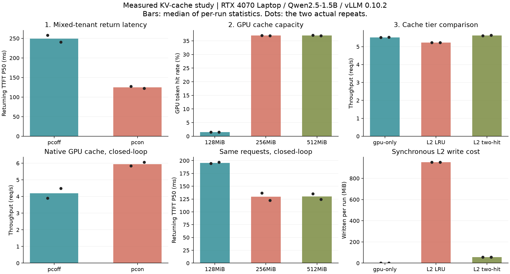
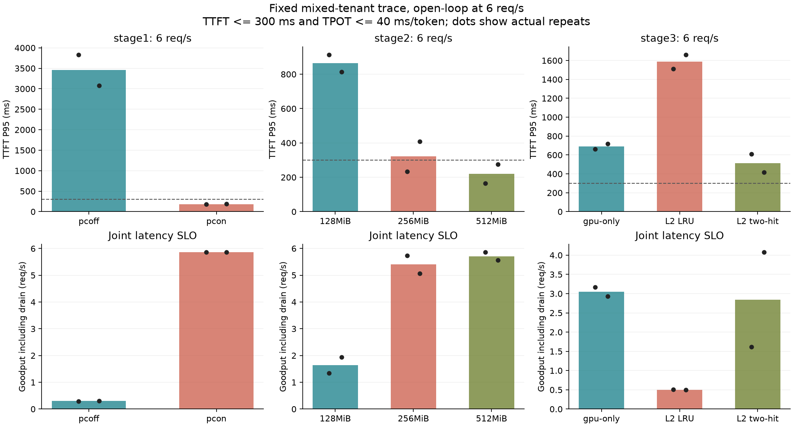

# 三阶段 KV Cache 实测报告

这组实验回答三个问题：真实续聊流量何时受益于 Prefix Cache；固定流量需要多大的 GPU KV pool；有限显存下，CPU L2 的复用收益是否足以支付搬运和写入成本。

环境为 RTX 4070 Laptop 8 GiB、Qwen2.5-1.5B-Instruct、FP16、vLLM 0.10.2、Docker Desktop/WSL。这里只报告这台机器上的实际测量，不把结果外推为生产容量。

**三阶段共 60 次正式运行、4,992 个测量请求，全部成功。** 请求/token 计数、到达率和实验矩阵完整性审计通过；预热、调试运行与 profile 不计入这 4,992 个请求。



## 阅读顺序与原始证据

- [第一阶段完整表格](stage1.md) / [每次运行 CSV](stage1.csv)：多场景、原生 Prefix Cache 开关。
- [第二阶段完整表格](stage2.md) / [每次运行 CSV](stage2.csv)：固定场景、GPU KV 容量扫描。
- [第三阶段完整表格](stage3.md) / [每次运行 CSV](stage3.csv)：GPU-only / CPU L2 / two-hit。
- [独立 PyTorch profile](profile.md)：诊断重算和搬运路径，不混入端到端计时。
- [原始数据与校验清单](../../prefix-study/published-20260913/manifest.json)：逐请求延迟、原始 Prometheus 快照、服务器日志、配置与正确性检查，采用无损 gzip 归档。



## 共同实验方法

每组固定模型、FP16、最大上下文 2048、服务端最大并发 4、最大 batch token budget 8192。输出固定 32 token、temperature=0、ignore EOS。vLLM V1 的实际日志仍显示 chunked prefill enabled；本实验每个请求至多约 1040 个输入 token，4 个并行请求也能放入这个 budget，未人为构造跨步 prefill。

此前的 `actual-stage1-smoke` 和 `actual-stage2` 不作为本报告数据来源。复查发现旧 workload 随轮次改变了本应稳定的前缀，旧 counter 区间包含预热；旧 L2 two-hit 还没有真正过滤首次写入。本报告在修正后重新跑完整矩阵，并保留旧文件作为调试记录。

workload 是可控的合成客服/Agent 会话：4 个 session，每个 8 轮，共 32 个前台请求。每个会话含固定的 512 个英文单词的 system/tool 上下文，后续历史只追加，保证旧文本是新 prompt 的精确前缀。历史采用固定文本回放，不依赖上一轮生成内容。`bg2` 在每次前台请求前插入 2 个不同租户的一次性请求，因此共 96 个请求、68 个不同的业务前缀。实际 token 数来自 vLLM usage；单词数不是 token 数。

每种条件重复 2 次，并保留每次原始结果。先完成模型加载、编译和独立预热，再重置 GPU Prefix Cache、CPU L2 内容和 two-hit 访问历史。测量前后等待指标更新，对照客户端请求/token 总数与 Prometheus counter 差值。不同缓存配置使用完全相同的 prompt 序列，并核对 SHA-256。计时使用客户端单调时钟，不依赖 Docker 与主机时钟同步。

- **Closed-loop**：4 个客户端 worker，上一个请求完成后再发下一个。同一 session 串行；有 idle gap 时，从上一轮完成算起至少等待 2 秒。HTTP 延迟不包含客户端思考时间，整体吞吐包含等待。
- **Open-loop**：按 3 或 6 req/s 均匀发送，发送计划不等待前一个请求完成。记录实际到达率、dispatch lag 和客户端 inflight，检查压测器是否真的提供了目标负载。这里只重放固定请求序列，不保证下一轮必须等模型完成，不能当作真实用户行为模型。
- **SLO/goodput**：请求成功且 TTFT <= 300 ms、TPOT <= 40 ms/token 才算达标。goodput 是达标请求数除以从开始发送到全部结束的时间，包括尾部 drain。这是预先固定的比较阈值，不是生产 SLA。
- 表格中的 P50/P95 是“两次运行各自分位数的中位数”，不是把所有请求混在一起重新计算。保留 P95 的两次运行范围，不把两次采样当成置信区间。
- WDDM 的 `nvidia-smi memory.used` 偶尔返回明显溢出的值，报告过滤超过 65536 MiB 的样本并保留无效样本计数和原始值。GPU pool 容量以 vLLM 启动日志为准，不能拿这些异常值绘制显存曲线。活跃 KV 使用率 gauge 也不是“所有空闲可复用前缀的占用率”。

## 第一阶段：先确认场景

这一阶段没有设置显式 KV 字节上限，也没有接入 CPU L2。原生 vLLM 在缓存开/关两种配置下都分配了 125,376 个 token 的 GPU KV pool，约 3428 MiB。比较 0/2000 ms 空闲间隔与 0/2 个背景请求，closed-loop 共 4 个场景；无人工空闲的两个场景再测 6 req/s open-loop。总计 24 次运行、1,536 个请求，全部成功。

下表为 closed-loop，续聊 TTFT 只统计同一 session 的第 2 至第 8 轮：

| 场景 | 续聊 TTFT P50：关/开 ms | 整体 TTFT P95：关/开 ms | 吞吐：关/开 req/s | 开启后的 GPU token 命中率 |
|---|---:|---:|---:|---:|
| 即时续聊、无背景 | 345.1 / 42.6 | 1082.5 / 455.7 | 3.74 / 6.45 | 83.4% |
| 即时续聊、混合租户 `gap0_bg2` | 249.1 / 124.8 | 600.4 / 186.4 | 4.20 / 5.95 | 37.0% |
| 间隔 2 秒、无背景 | 590.4 / 145.6 | 813.4 / 479.4 | 1.33 / 1.60 | 83.4% |
| 间隔 2 秒、混合租户 | 133.7 / 37.0 | 224.7 / 179.9 | 4.28 / 4.70 | 37.0% |

主要结论：

1. Prefix Cache 对相同 token 前缀的续聊有效。第一轮冷启动仍然需要 prefill，所以“续聊 P50 已经很低”和“整体 P95 仍然较高”可以同时成立。
2. 本次 2 秒空闲并没有使缓存命中率消失。vLLM 的原生复用主要取决于 block 是否仍在缓存中；这不是长期 TTL 实验，不能用 2 秒结果证明任意长时间都能保留。
3. 混入冷请求后，整体命中率从约 83% 降为约 37%，但这里的分母也增加了。第一阶段的大 KV pool 足以容纳这个工作集，不能把这一下降全解释为淘汰。
4. `gap0_bg2` 在 open-loop 6 req/s 下，缓存关闭的 TTFT P95 约 3455 ms，开启后约 184 ms；SLO 达标率从约 6.25% 到 100%。其中相当一部分收益来自排队缓解，不能全算成单次 prefill 的加速倍数。
5. 笔记本空闲状态、组批形状和运行顺序都会影响延迟。例如无背景、2 秒间隔的请求延迟高于混合流量。命中 counter 更稳定；具体倍数应同时看两次运行范围，不能认定背景流量本身会提高性能。

**后续固定 `gap0_bg2`**：它有可复用的 4 个会话，也有 64 个一次性冷前缀；两次访问同一会话之间相隔 12 个请求，更适合观察有限容量和 admission policy。后续不再增加背景比例或更换输入序列。

## 第二阶段：固定场景，扫描容量

只调整 vLLM 启动参数 `--kv-cache-memory-bytes`，分别为 128、256、512 MiB。场景、seed、轮次、请求数、输出长度和负载强度保持一致。每个容量测 closed-loop 并发 4，以及 open-loop 3/6 req/s，各重复 2 次；完整数值见 [stage2.md](stage2.md)。

这里的“可变容量”是不同进程配置下的敏感性扫描，不是运行中自动扩缩容。Qwen2.5-1.5B 的 FP16 KV 约为 `2(K/V) × 28 layers × 2 KV heads × 128 head_dim × 2 bytes = 28 KiB/token`。16-token block 约为 448 KiB；因此容量必须向整块取整，不能把 MiB/token 的估算直接当作所有请求均可用的空间。活跃请求和可复用缓存共用这个 pool。

第二阶段共 18 次运行、1,728 个请求，全部成功，未观察到 preemption。启动日志实际确认的 GPU KV token 容量如下：

| KV 上限 | 实际 token 容量 | Closed GPU token 命中率 | Closed 续聊 TTFT P50 ms | Closed 整体 TTFT P95 ms | Closed 吞吐 req/s |
|---|---:|---:|---:|---:|---:|
| 128 MiB | 4,672 | 1.47% | 195.7 | 257.2 | 5.49 |
| 256 MiB | 9,360 | 36.93% | 129.5 | 180.0 | 6.04 |
| 512 MiB | 18,720 | 36.97% | 129.8 | 180.4 | 6.03 |

| KV 上限 | 3 req/s：TTFT P95 ms | 6 req/s：TTFT P95 ms | 6 req/s：goodput req/s | 6 req/s：SLO 达标率 |
|---|---:|---:|---:|---:|
| 128 MiB | 99.2 | 863.9 | 1.64 | 29.17% |
| 256 MiB | 69.9 | 321.3 | 5.40 | 92.19% |
| 512 MiB | 69.2 | 221.0 | 5.71 | 97.40% |

主要结论：

1. **128 MiB 的复用空间不足**。相同请求序列下命中率只有约 1.47%，而 256/512 MiB 恢复到接近第一阶段的 37%。因为前缀和分母完全相同，这比跨场景比较命中率更能支持“容量导致重算”的解释。没有 preemption 不代表没有已完成前缀被驱逐。
2. **容量拐点位于已采样的 128 与 256 MiB 之间**。4 个会话的热前缀加上两次复用之间的背景流量，在 256 MiB 左右可以得到保留。256→512 MiB 的 closed-loop 吞吐和命中率几乎不变；尚未扫描中间容量，不能宣称 256 MiB 是精确最优值。
3. **低到达率会掩盖容量问题**。3 req/s 时即使经常重算，128 MiB 仍能保持约 99% 的 SLO 达标率；6 req/s 时，重算与排队共同放大尾延迟。不能只拿低负载的一组 TTFT 判断容量够不够。
4. **不宣称测得了稳定 6 req/s 容量**。256 MiB 的两次联合 SLO 为约 97.92% / 86.46%；512 MiB 为 100% / 94.79%。即使 512 MiB 的两次中位数超过 95%，也没有做到两次都超过 95%。需要更长运行和更多重复才能建立可靠服务容量。

第三阶段因此使用 **128 MiB GPU KV**，使 CPU L2 面对真实发生的 GPU miss；如果使用已经基本装得下热工作集的 512 MiB，新增 L2 可能几乎没有机会体现作用。

## 第三阶段：同一负载，比较三个缓存层级

固定 GPU KV pool 为 128 MiB，接入 CPU 时固定为 512 MiB。

| 组别 | GPU miss 之后 | CPU 写入策略 |
|---|---|---|
| `gpu-only` | 重新 prefill | 无 CPU L2 |
| `gpu-cpu-l2` | CPU 命中则加载，否则 prefill | 新前缀首次访问即可写入，超限 LRU 淘汰 |
| `gpu-cpu-l2-two-hit` | 同上 | 第二个不同请求再次访问后才允许写入，超限 LRU 淘汰 |

这是一个同步的、固定前缀长度的单机实验 connector。每次缓存最前面的 512 个 token，复用 vLLM 官方 SharedStorageConnector 的 tensor 读写路径；28 层全部写完后才建立完成标记，容量在整步保存完成后淘汰。调度器侧与 worker 侧通过目录访问时间共享 LRU 状态。two-hit 历史最多保留 8192 个 key，本次工作集远低于这个限制。

CPU L2 使用 Linux tmpfs，主要为内存文件系统；没有把 Windows 挂载目录的磁盘 I/O 伪称为纯 CPU 内存访问。它仍包含 safetensors 序列化、张量索引、同步 D2H/H2D 和文件系统开销，也不是 pinned-memory 异步搬运。发布后的 KV 数据限制为 512 MiB，暂存正在写入的一批前缀需要额外余量，不能宣称整个进程或 tmpfs 总内存严格只有 512 MiB。tmpfs 也可能受系统换页影响，本实验不提供独立的 swap 证明。

除了端到端指标，额外记录实际 loads/stores、external token 数、admission 拒绝数、淘汰数、写入/读出 MiB 和同步保存/加载耗时。只有 worker 确实回载了 tensor 才计作 load；仅创建了缓存文件或启动成功不算证明 L2 有效。

第三阶段共 18 次运行、1,728 个请求，全部成功。这里使用第三阶段重新测量的 GPU-only 基线，不能拿不同阶段较慢的一组基线计算 L2 收益。

| 组别 | Closed 续聊 TTFT P50 ms | Closed 整体 TTFT P95 ms | Closed 吞吐 req/s | 6 req/s 整体 TTFT P95 ms | 6 req/s goodput | 6 req/s SLO |
|---|---:|---:|---:|---:|---:|---:|
| GPU-only | 195.9 | 256.5 | 5.52 | 689.7 | 3.05 | 54.17% |
| GPU + CPU L2 LRU | 224.2 | 273.8 | 5.23 | 1587.9 | 0.50 | 9.38% |
| GPU + CPU L2 two-hit | 170.5 | 243.5 | 5.62 | 513.2 | 2.85 | 49.48% |

每次 96 请求的 closed-loop 测量中，L2 行为为：

| 策略 | 实际 CPU loads | 新增复用 token | Stores | 拒绝准入 | CPU 淘汰 | 写入 MiB | 读出 MiB | 最后驻留 MiB |
|---|---:|---:|---:|---:|---:|---:|---:|---:|
| LRU | 28 | 14,336 | 68 | 0 | 32 | 952.16 | 392.07 | 504.08 |
| two-hit | 24 | 12,288 | 4 | 68 | 0 | 56.01 | 336.06 | 56.01 |

两者 GPU token 命中率都约为 1.47%，CPU external token 另计，不能把 CPU 命中伪装成 GPU 命中。two-hit 拒绝的 68 次包括 64 个一次性背景前缀和 4 个会话的首次访问；第二次访问才写入，之后的 6 轮共发生 24 次加载。

主要结论：

1. **未经筛选的同步 CPU L2 会更慢**。虽然 LRU 命中更多，但每轮为一次性流量写入近 1 GiB 数据，还发生 32 次淘汰。closed-loop 吞吐比 GPU-only 低约 5.2%；高负载下这些额外成本会继续放大排队。
2. **two-hit 最明确的收益是减少污染和写放大**。写入从 68 次降到 4 次，字节减少 **94.1%**；closed-loop 保存 hook 的累计墙钟时间约从 4305 ms 降到 467 ms。这个计时包含同步等待和序列化，也不包含所有容量扫描成本，不能解释成纯 PCIe 传输时间。
3. **端到端收益要如实限定**。two-hit 的 closed-loop 吞吐比普通 L2 高约 **7.4%**，但比 GPU-only 只高约 **1.8%**；续聊 P50 降低约 13%。两次短测不足以证明这个小吞吐提升具有统计显著性。
4. **P95 更低不保证 goodput 更高**。6 req/s 时 two-hit 的 P95 小于 GPU-only，但 goodput 为 2.85，对照为 3.05 req/s；two-hit 两次 goodput 分别约 1.61 / 4.08，波动明显。goodput 取决于整段分布落在联合阈值以内的比例，不能只由 P95 推断。
5. **本机的直接选择仍是预留足够的 GPU KV**。如果可以多给约 128 MiB 显存，第二阶段的 256 MiB GPU-only closed-loop 吞吐约 6.04 req/s，比这里的 128 MiB + two-hit L2 更好，实现也更简单。CPU L2 在本项目中的价值是可测量的补充路径和准入实验，不是替代 GPU cache 的通用加速方案。

## Profile 与正确性

额外执行了独立的“三次相同 prompt”诊断：输入 578 token，每次输出 16 token；每次请求前清空 GPU Prefix Cache。GPU-only 三次都重算；普通 L2 第一次写入、后两次加载；two-hit 第一次不写入、第二次写入、第三次加载。两种 L2 与各自冷启动重算得到的 greedy 输出一致，原始响应与 counter 保存在 `l2-correctness.json.gz`。

保存了 6 份 PyTorch trace：每组一个 API 进程 trace 和一个 GPU worker trace。下表是独立诊断的 worker 事件汇总，不是三阶段压力测试的延迟结果：

| 组别 | CUDA kernel 事件数 | kernel duration 总和 ms | H2D MiB | D2H MiB |
|---|---:|---:|---:|---:|
| GPU-only | 18,486 | 777.1 | 0.075 | <0.001 |
| CPU L2 LRU | 18,626 | 992.0 | 28.384 | 14.000 |
| CPU L2 two-hit | 18,570 | 932.4 | 14.284 | 14.000 |

这些事件证实 L2 发生了真实的主机/GPU 数据搬运，two-hit 诊断中少了一次加载。它们没有证明 kernel 总时间下降；输入 shape、使用的 kernel、索引/拷贝和运行波动都会影响结果，不能只看缓存命中数推导 GPU 时间。主要热点包含 cuBLAS GEMV/GEMM、FlashAttention 和 Triton elementwise kernels，具体名称与时长见 [profile.md](profile.md)。

Profiler 日志出现了 PyTorch `External init callback` 线程警告；三个 GPU worker trace 均有非空的 CUDA kernel/memcpy 事件。API 侧的 Python 嵌套事件时长不能求和作为请求延迟；不同 CUDA stream 的事件也可能重叠。profile 只用于诊断，端到端结论来自没有开启 PyTorch profiler 的正式运行。

验证结果：本机 13 项测试通过，依赖 vLLM 的 5 项策略测试在固定 Docker 镜像内通过；PowerShell 语法检查通过；60 次测量的指标审计全部通过。覆盖稳定前缀、包含背景的 reuse distance、同一请求重试不触发 two-hit、完整 KV 才可读、LRU/超大条目淘汰、重置准入历史，以及只统计分配成功的外部命中。

## 复现

在仓库目录激活 Python 环境，确认 Docker Linux engine 和 NVIDIA GPU 可用、模型已缓存，然后运行：

```powershell
python -m vllm_serving_lab.prefix_study --stage 1 --output results/prefix-study/replay-stage1
python -m vllm_serving_lab.prefix_study --stage 2 --output results/prefix-study/replay-stage2
python -m vllm_serving_lab.prefix_study --stage 3 --output results/prefix-study/replay-stage3 --profile
python -m vllm_serving_lab.prefix_report --stage stage1 --input-dir results/prefix-study/replay-stage1 --output results/prefix-reports/replay-stage1.md
python -m vllm_serving_lab.prefix_report --stage stage2 --input-dir results/prefix-study/replay-stage2 --output results/prefix-reports/replay-stage2.md
python -m vllm_serving_lab.prefix_report --stage stage3 --input-dir results/prefix-study/replay-stage3 --output results/prefix-reports/replay-stage3.md
```

每次使用新目录。`--smoke` 只检查链路，不符合正式矩阵审计的完整性要求。历史记录里的 `git_head` 是运行时尚未提交修改的基础提交；最终可复现实现与数据一起提交，归档清单还保存发布源码的 SHA-256。不要只检出旧的 `git_head` 后假定其中已包含本次修正。

## 面试复述与技术词

可以沿着“流量局部性 -> 容量瓶颈 -> 搬运与重算权衡”讲述：先建立有稳定前缀、追加历史和冷流量的回放，验证原生缓存；然后固定所有输入只改 GPU pool；最后接入简单 L2 和 two-hit，用 counter 证明实际命中，用独立 profile 判断写入/回载开销，用 open-loop 查看排队和 SLO。

| 技术词 | 在本实验中的含义 |
|---|---|
| Prefix Cache / APC | 多个请求有完全相同的 token 前缀时，复用已有 KV，减少 prefill |
| KV block / pool | vLLM 按固定 token 块管理显存；缓存页与活跃序列共享有限池 |
| Reuse distance | 同一个会话的相邻两次访问之间相隔多少条请求；这里包含背景请求 |
| LRU | 空间不足时先淘汰最久未访问的条目 |
| Admission / two-hit | 决定是否让新条目进入缓存；第二次访问后才准入，过滤一次性流量 |
| tmpfs / safetensors | 内存文件系统 / 保存张量的文件格式；仍有序列化与访问开销 |
| H2D / D2H | 主机内存到 GPU / GPU 到主机内存的拷贝 |
| TTFT / TPOT | 首个非空流式输出等待时间 / 首 token 之后的平均输出间隔 |
| Open-loop / closed-loop | 固定外部到达率 / 完成一个请求才继续发请求的反馈式负载 |
| Goodput | 满足联合延迟阈值的有效请求完成速率 |
| Prometheus / PyTorch profiler | 服务端累计指标与直方图 / 具体算子、CUDA kernel 和拷贝事件的 trace |

求职时应说实现了 workload、实验闭环、一个有限容量的实验 L2 connector 和 two-hit 准入；原生的 KV 分页、Prefix Cache、调度器和 attention kernel 来自 vLLM。不要将这里的同步 tmpfs 实验包装成生产级多机缓存系统。
